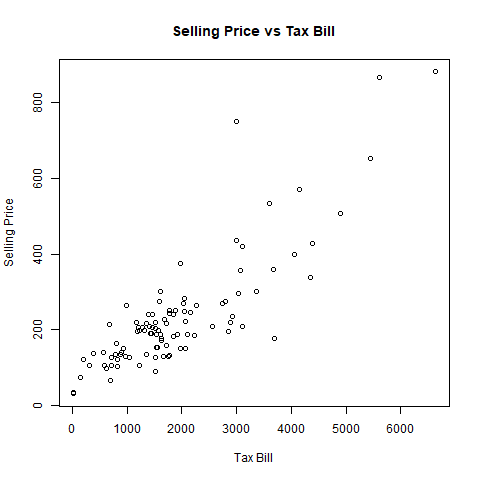
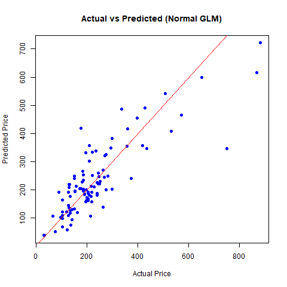
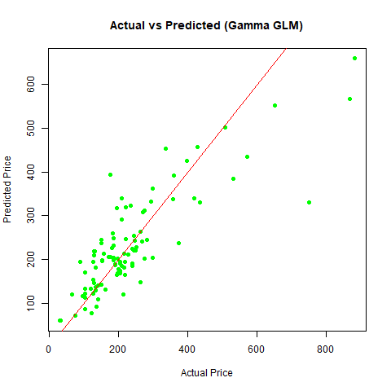
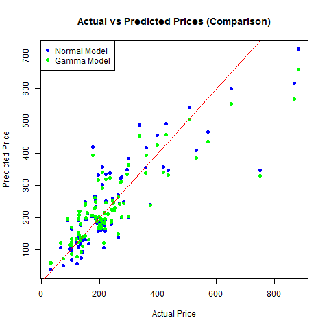

# 🏠 Housing Prices GLM Analysis

This R project analyzes the relationship between property tax bills and housing prices using Generalized Linear Models (GLMs). It compares a **Gaussian** and a **Gamma** GLM with identity link functions.

## 📦 Dataset

- **Source**: [Houses.dat](https://stat4ds.rwth-aachen.de/data/Houses.dat)
- **Features used**:
  - `price`: Selling price of a house
  - `taxes`: Property tax amount
  - `new`: Whether the house is new (1) or not (0)

---

## 🔍 Objective

- Explore potential **heteroscedasticity** (non-constant variance) in the relationship between selling price and tax.
- Compare model performance and assumptions using two types of GLMs.
- Visualize prediction accuracy.

---

## 📈 Visualizations

### 📌 Scatter Plot: Tax Bill vs Selling Price
Shows the raw relationship between tax bill and house price.



---

### 📌 Actual vs Predicted Prices – Gaussian Model

Model assumes **constant variance** in the response variable.



---

### 📌 Actual vs Predicted Prices – Gamma Model

Model assumes **variance increases with the mean** (more suitable for skewed data).



---

### 📌 Combined Comparison

Both models shown on the same plot for easier comparison.



---

## 🧠 Statistical Modeling

| Model         | Link Function | Distribution Assumption             | AIC     |
|---------------|---------------|--------------------------------------|---------|
| Gaussian GLM  | Identity      | Constant variance (homoscedasticity) | 1110.5  |
| Gamma GLM     | Identity      | Variance ∝ mean² (heteroscedasticity) | 1144.0  |

### ✅ Based on AIC, the **Gaussian model is preferred**, but residual patterns suggest heteroscedasticity, favoring Gamma in some contexts.

---

## 🚀 Running the Code

Make sure you have **R** installed and the `readr` package:

```r
install.packages("readr") 
source("GLM_housedata.R")
